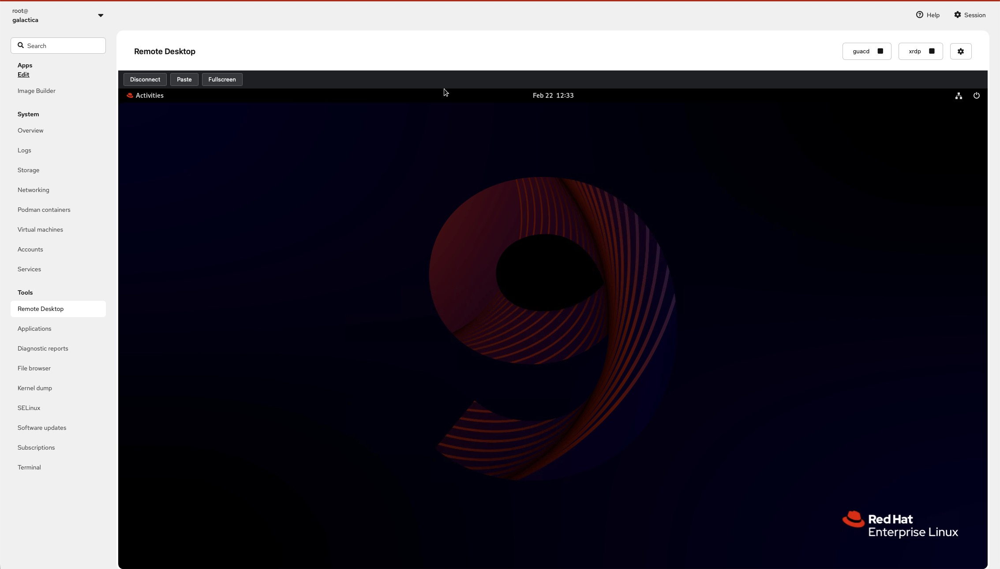

# cockpit-guacamole


A [Cockpit](https://cockpit-project.org/) plugin that provides browser-based remote desktop access using [Apache Guacamole](https://guacamole.apache.org/) and [xrdp](http://xrdp.org/).

No external proxy or Guacamole server infrastructure required -- the plugin talks directly to `guacd` through Cockpit's built-in channel API.



## Features

- **In-browser remote desktop** -- RDP sessions rendered directly in the Cockpit UI
- **Zero-proxy architecture** -- uses a custom `Guacamole.Tunnel` over Cockpit's TCP channel, eliminating the need for guacamole-lite or a full Guacamole server
- **Service management** -- start, stop, and enable `guacd` and `xrdp` from the UI
- **Auto-install** -- missing packages (`guacd`, `xrdp`, `libguac-client-rdp`) are installed automatically via PackageKit
- **Clipboard paste** -- send text to the remote session through a paste dialog
- **Fullscreen mode** -- expand the remote desktop to fill the screen with an auto-hiding toolbar
- **Configuration panel** -- adjust session disconnect timeout, enable/disable services at boot, and manage GPU group membership (`render`, `video`)
- **Auto-scaling display** -- the remote desktop resizes to fit the browser window

## How It Works

```
Browser (Cockpit UI)
  └─ Guacamole JS Client
       └─ CockpitTunnel (cockpit.channel, binary TCP)
            └─ guacd (:4822)
                 └─ xrdp (:3389)
                      └─ Desktop Session
```

The plugin opens a raw TCP channel to `guacd` via Cockpit's bridge and performs the Guacamole protocol handshake (select, args, connect) entirely in JavaScript. All rendering is handled client-side by `guacamole-common-js`.

## Prerequisites

- **Cockpit** installed and running
- **Fedora / RHEL / CentOS** (or any distro with PackageKit and systemd).  If running on RHEL you must enable the CodeReady Builder and EPEL repos to get guacd and xrdp.
- NodeJS/NPM installed for building from this repo - Deb/RPM packages to come soon
- A Desktop Environment like GNOME `dnf install @gnome-desktop`
- `guacd`, `xrdp`, and `libguac-client-rdp` can be installed through the Cockpit Remote Desktop UI if not already present.

## Installation

### From source

```bash
# Clone and build
git clone https://github.com/kenmoini/cockpit-guacamole.git
cd cockpit-guacamole
npm install
npm run build

# Install to your local Cockpit plugins directory
make install
```

The plugin will appear as **Remote Desktop** in the Cockpit sidebar.

### Development

```bash
# Symlink the dist/ folder for live development
make devel-install

# Rebuild on file changes
npm run watch
```

## Tech Stack

| Layer       | Technology                          |
| ----------- | ----------------------------------- |
| UI          | PatternFly 6, FontAwesome 7, SCSS  |
| RDP Client  | guacamole-common-js 1.5             |
| Build       | esbuild + esbuild-sass-plugin       |
| System APIs | Cockpit JS bridge (spawn, dbus, file, channel) |

## Tested Platforms

- Fedora 40, 41, 42
- RHEL 9

## Common Problems

- **When logging in, it immediately disconnects.**
  This is likely due to a lack of a desktop environment.  Install GNOME or another DE.
- **When connecting the screen tears and jitters.**
  This is due to a stale session lock.  Run `pkill Xvnc` to release the session.
- **The Xrdp service fails to load.**
  This might be due to another RDP service (like GNOME Remote Desktop) running on the default port 3389 and so Xrdp cannot start and bind to that same port.  You can use the Configuration menu in the Remote Desktop plugin to reconfigure the port for Xrdp.